# Project description

Hotel task is for manage the relationship between the supervisor and assigned employees in a specific hotel.
The main purpose of the make the interaction is easy for the supervisor and employees.
  

## Features

- Instant translation between Arabic and English
- Play different notification sounds according to order state.
- Orders state (Active - Pending - Finished -Late).
- Supervisor manage the state of assigned employees.
- Web-view for access the dash board for the supervisors and employees.
- Filter orders according date.
- Notifications are sent to employees when the supervisor change his active state.
- Notifications are sent when the state of an order changed.

## Skills
#### Use in this project the following:
- BLOC and cubit state management.
- Push notifications (Firebase).
- Diffrent notification sounds.
- Localization and translation (Arabic - English).
- MVVM architecture pattern.
- Dealing with REST APIs and postman.
## Screenshots
#### #auth
    The user will be able to login using his e-mail, password
    and his hotel code

  
  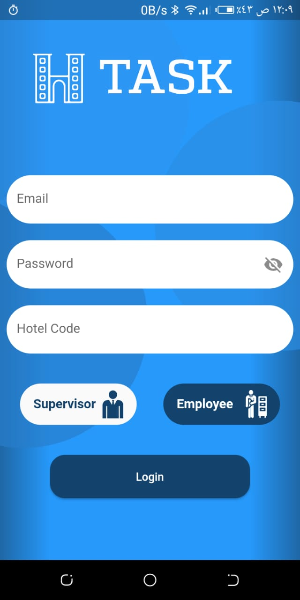

#### #supervisor
    - The supervisor will able to manage employees he assigned to.
    - Enter to dashbord using web-view.
    - see the orders.
    - Assign orders to employees.

  
  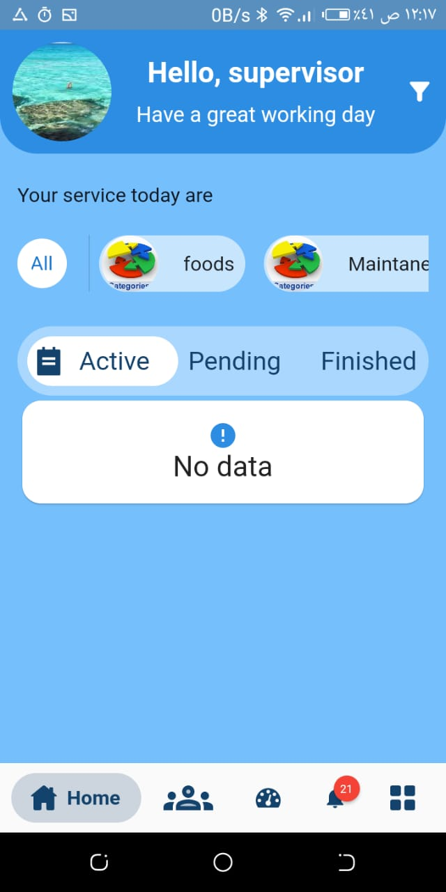
  &nbsp; &nbsp; &nbsp; &nbsp;
  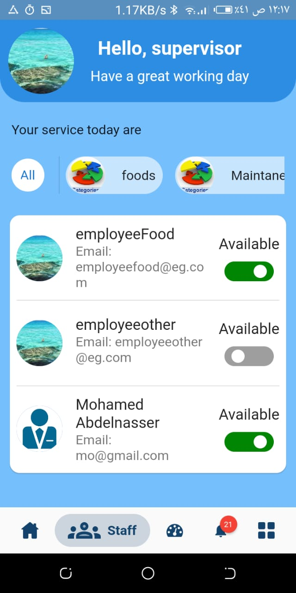

#### #Employee
    - The employee see his assigned orders.
    - Able to change the order state.
    - Enter to dashboard to monitor the stats.

  
  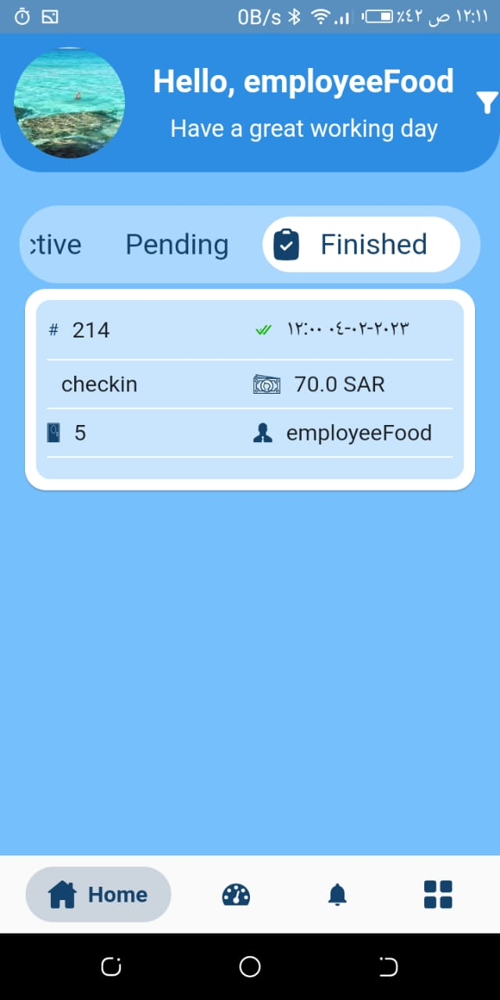
  &nbsp; &nbsp; &nbsp; &nbsp;
  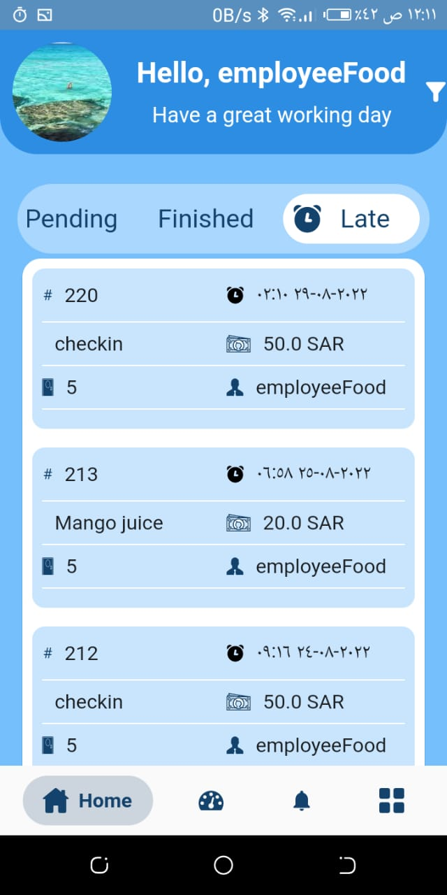
  &nbsp; &nbsp; &nbsp; &nbsp;
  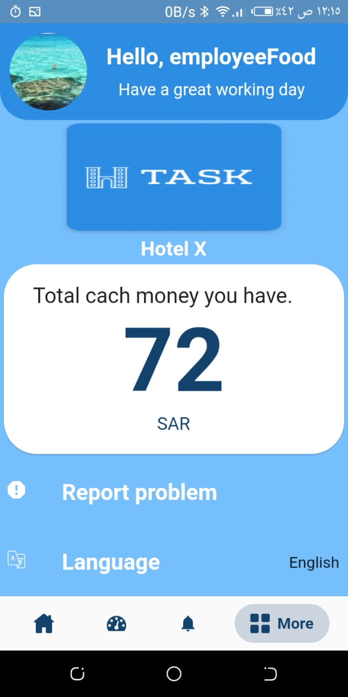
  &nbsp; &nbsp; &nbsp; &nbsp;
  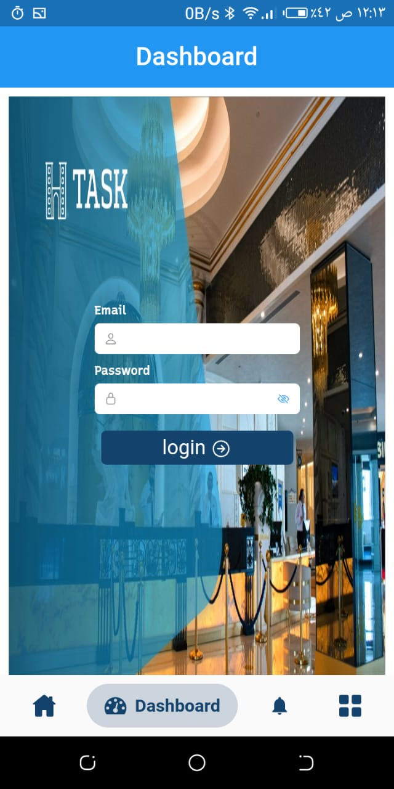

#### #Orders details

  
  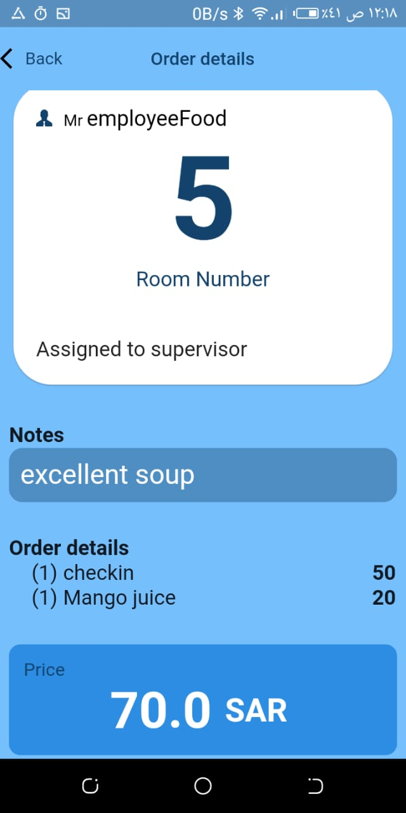
  &nbsp; &nbsp; &nbsp; &nbsp;
  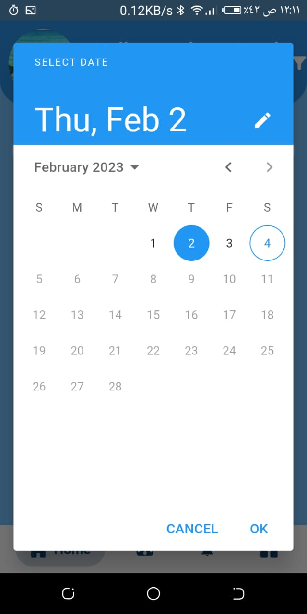

#### #Notifications

  
  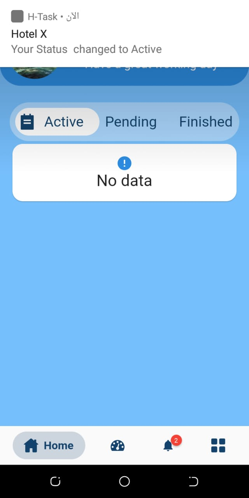
  &nbsp; &nbsp; &nbsp; &nbsp;
  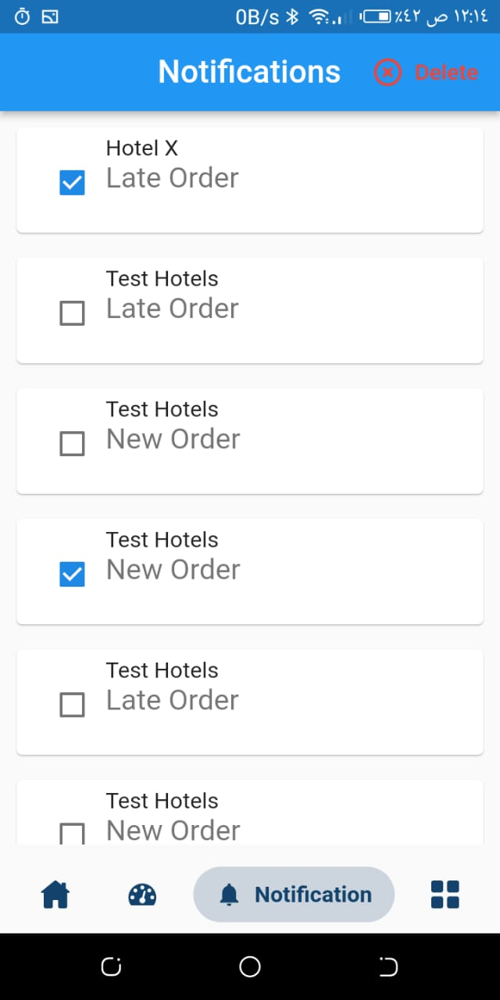

